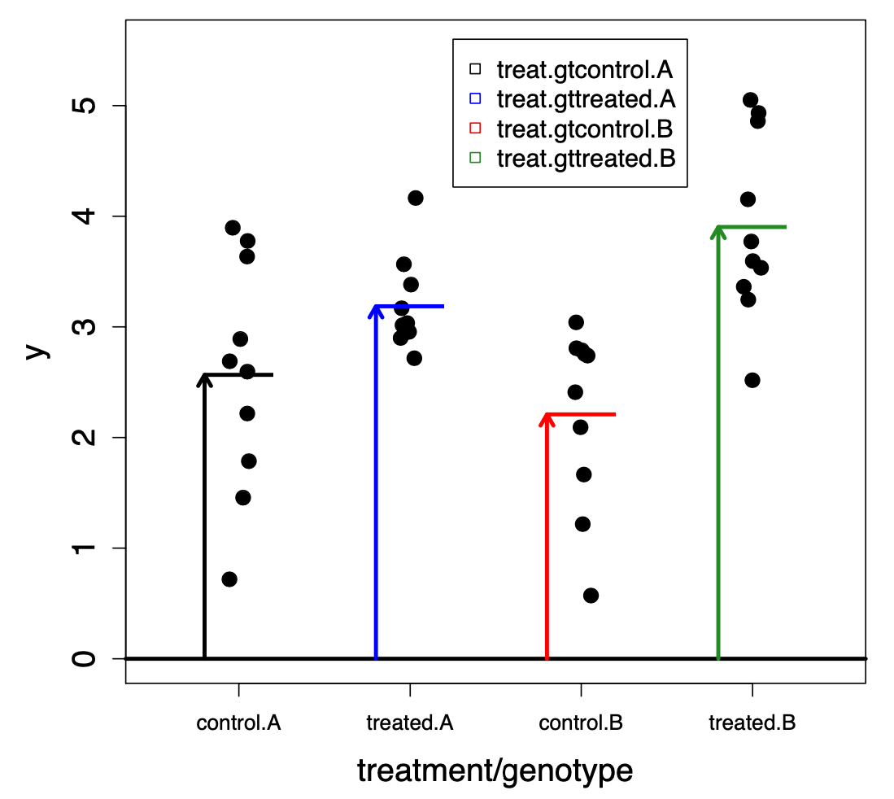

<!-- TODO create an object to load the environment instead of initialising it at the beginning.
Actually multiple objects at different step in the pipeline -->

```{r setup, include=FALSE}
# to run locally replace tutorials/03_differential_gene_expression/www with inst/tutorials/03_differential_gene_expression/www

# to run as an app replace tutorials/03_differential_gene_expression/www with www

# libs
suppressPackageStartupMessages({
  library(DESeq2)
  library(here)
  library(learnr)
  library(MASS)
  library(tidyverse)
  library(vsn)
})
  
# options
knitr::opts_chunk$set(echo = FALSE)
tutorial_options(
  exercise.reveal_solution=TRUE,
  exercise.lines=10)

# step to reproduce
# ---
# data
# txi <- readRDS(here("tutorials/03_differential_gene_expression/www/tximport.rds"))
# counts <- round(txi$counts)
# sample_file <- here("tutorials/03_differential_gene_expression/www/samples_table.tsv")
# samples <- read_tsv(sample_file,col_types=c("cfff"))
# dds <- DESeqDataSetFromTximport(
#   txi=txi,
#   colData = samples,
#   design = ~ time * treatment)
# saveRDS(dds,file=here("tutorials/03_differential_gene_expression/www/dds-pre.rds"))
# dds <- DESeq(dds)
# saveRDS(dds,file=here("tutorials/03_differential_gene_expression/www/dds-post.rds"))
# G03_vs_G02_at_T03 <- results(dds,name="treatment_G03_vs_G02")
# saveRDS(G03_vs_G02_at_T03,file=here("tutorials/03_differential_gene_expression/www/G03_vs_G02_at_T03.rds"))
# G03_vs_G02_at_T04 <- results(dds,list(c("treatment_G03_vs_G02","timeT04.treatmentG03")))
# saveRDS(G03_vs_G02_at_T04,file=here("tutorials/03_differential_gene_expression/www/G03_vs_G02_at_T04.rds"))
# dds_T04 <- dds[,dds$time=="T04"]
# design(dds_T04) <- ~ treatment
# dds_T04 <- DESeq(dds_T04)
# saveRDS(dds_T04,file=here("tutorials/03_differential_gene_expression/www/dds_T04-post.rds"))
# G03_vs_G02_at_T04_simple <- results(dds_T04)
# saveRDS(G03_vs_G02_at_T04_simple,file=here("tutorials/03_differential_gene_expression/www/G03_vs_G02_at_T04_simple.rds"))
```

## Introduction

In the previous tutorial, we saw that the data quality looks good, one sample was sequenced at a lower depth that the others, but it did not appear to  be a reason to worry after we conducted the Exploratory Data Analysis (EDA). On the other hand, the Principal Component Analysis (PCA) and the heat-map revealed that the third dimension was explained by the `B` replicates, while the first, second and forth could be explained by either of the studies design variable: `time` and `treatment`. The heat-map revealed a possible origin for that, in the sense that at time-point `T03` the data is classifying by replicates, while at time `T04`, it classifies by `treatment`. 

This gives us some food for thoughts, as we need to decide how to best conduct the Differential Gene Expression (DGE) analysis, especially when looking at the `treatment` effect.

Before we get there though, we need to learn a bit more about the processes that `DESeq2`, the package we will use for DGE is doing. 

```{r intro-quizz}
quiz(caption="RNA-Seq data normalisation",
      question("We have seen previously that RNA-Seq data needs to be normalised for:",
               answer("the difference in sequencing depth",correct=TRUE),
               answer("the data heteroscedasticity",correct=TRUE),
               answer("the total size of the transcriptome in bp"),
               answer("differently for single-end (SE) and paired-end (PE) sequencing")))
```

Furthermore, we have seen that correcting for the library size differences introduced the most important assumption about DGE (the same would apply to Differential Transcript Expression (DTE), obviously), namely that we assume that **"most genes are not differentially expressed"**. 

We have also seen that RNA-Seq data is best explained by a _negative binomial distribution_ with

$$\vartheta^{2} = \mu + \theta\mu^{2}$$

where $\theta$ is the dispersion and $\mu$ the mean. It can be noted that $\mu$ models the technical noise of the data while $\sqrt{\theta}$ represents its "biological coefficient of variation".

These are the properties of the data we have already seen, but the design of most biological studies brings in a couple additional challenges. Indeed, the data we work with has very different dimensions; it is typically the observation of many genes across few samples - and this results in the following limitations:

1. few samples makes it hard to estimate parameters (such as _e.g._ the BCV $\sqrt{\theta}$)
2. many genes means we are running many tests

## `DESeq()`

But before we look at the limitations we just mentioned in details, let's run `DESeq()`! Figure out how to (the `dds` object is present in the environment already).

```{r dds-pre, include=FALSE}
dds <- readRDS(here("tutorials/03_differential_gene_expression/www/dds-pre.rds"))
```

```{r deseq, exercise=TRUE, exercise.eval=TRUE,exercise.timelimit=300, exercise.setup="dds-pre"}
dds

```

```{r deseq-hint}
?DESeq
```

```{r deseq-solution}
dds <- DESeq(dds)
```

And that's it! In a single command, we have run the DGE! In a way, `DESeq()` is a black box. This is in my opinion, the biggest difference with the other, equally well performing, DE package `edgeR` (see [Schurch _et al._, RNA, 2016](https://doi.org/10.1261%2Frna.053959.115) for a comparison of DE tools). `DESeq2` hides the complexity away from the end-user, making automated educated decision based on the properties of the data, while `edgeR` leave all decisions to the end-user who needs to combine the different steps of the DE analysis on its own. Nonetheless, the `DESeq()` steps can be decomposed as we have seen in the previous tutorial with _e.g._ the `estimateSizeFactors()` step we ran, but `edgeR` remains the most versatile of the two (_caveat:_ provided you know what you are doing).

Last but not least, `DESeq()` is unlike a true black box, exposing all the steps it performs

```{r deseq-quizz}
quiz(caption="`DESeq()` steps",
      question("Out of the six steps mentioned by `DESeq()`, which ones address the difference in sequencing depth and data heteroscedasticity?",
               answer("the first and second"),
               answer("the first only"),
               answer("all but the sixth",correct=TRUE),
               answer("all")))
```

### Unbalanced data dimensions

The first and second steps are about calculating the normalisation factor (for the sequencing depth) and the dispersion (of the negative binomial distribution), respectively. The third to fifth are actually addressing the first common issue of biological studies design we mentioned earlier.

Let us visualise the problem. Imagine a gene which true average expression is `3` in an infinitely sized population. We perform a studies in which we sample 3 individuals from that population (_i.e._ three biological replicates). We can simulate the results, assuming the expression of the gene to be normally distributed in the population, centered on 3 as follows: `rnorm(n=3,mean=3)`. For the sake of the argument, imagine we could redo that experiment a thousand times and compare the resulting average distribution we obtain to the "truth". Run the code below to see the results.

```{r params, exercise=TRUE, exercise.eval=TRUE}
ggplot(tibble(x=sapply(1:1000,function(i){mean(rnorm(3,mean=3))}))) +
  geom_histogram(aes(x=x)) + geom_vline(xintercept=3,color="red",linetype="dashed") +
  xlim(0,6) + labs(x="measured expression")
```

Using the block above, simulate what would happen if you were to increase the sampling size.

```{r params-quiz}
quiz(caption="The more samples...the merrier",
     question("When did you observe a visual difference?",
              answer("4"),
              answer("6"),
              answer("12",correct=TRUE),
              post_message="There is a no exact answer, but Schurch _et al._ highlighted the number 12 in their publication."))
```

Now that we have visualised the limitation of having few samples, let me remind you of the assumption we already made: that **"most genes are not DE"**. Could we use this at our advantage here? The answer is *YES*. Based on that assumption, we can further assume that most genes are drawn from the same population with the same characteristics. In other words, we have done many sampling as in the naïve examples above. So, if we model the dispersion distribution (it will be heteroscedastic), we can then **shrink** the dispersion values we calculated towards the center value defined by the model. With that information, use the `plotDispEsts()` function to visualise and interpret that process.

```{r dds-post, include=FALSE, eval=TRUE}
dds <- readRDS(here("tutorials/03_differential_gene_expression/www/dds-post.rds"))
```

```{r disp, exercise=TRUE, exercise.eval=TRUE, exercise.setup="dds-post"}

```

```{r disp-hint}
?`plotDispEsts,DESeqDataSet-method`
```

```{r disp-solution}
plotDispEsts(dds)
```

The black dots are the initial dispersion values, the red line is the variance-mean relationship model and the blue dots are the shrunk dispersion estimates.

```{r disp-quiz}
quiz(caption="Have you noticed?",
     question("What are the blue circles in the top right corner of the plot?",
              answer("genes which could not be shrunk",correct=TRUE),
              answer("genes without expression"),
              answer("genes used as a training set for the model"),
              answer("genes used as a testing set for the model")))
```

### Multiple testing

Once `DESeq()` has estimated all the parameters it needs, it will apply its model to test for differential expression according to the `design` we provided. We will next look at models before looking into the results of the DGE, but for now we will have a look at the last challenge of RNA-Seq data analysis, namely the fact that we have high dimensionality in our data: we have many genes, so we will perform as many tests.

---

#### p-values

Every test will return a test score associated with a significance value; a p-value. Do you recall statistics 101?

**The p-value is the probability of obtaining a test statistic at least as extreme as the one observed, if the null hypothesis is true** ( _i.e._ if there is not true signal in the data).

```{r p-value-quiz}
quiz(caption="Probabilities",
     question("In the absence of real signal, what is the p-value of getting a test statistic having a 5% probability?",
              answer("0.025 if the test is two-sided"),
              answer("5%",correct=TRUE),
              answer("95%"),
              answer("0.975 if the test is two-sided")),
     question("In the absence of signal, in a study with 10,000 genes, how many p-value equal to or smaller than 5% would we get?",
              answer("none!"),
              answer("500",correct=TRUE),
              answer("it will vary from studies to studies"),
              answer("250 if the test is two-sided")))
```

--- 

No comments...

{width=80%}

---

#### False Discovery Rate

**We clearly need to change perspective!** Instead of limiting the false positive probability for each _individual_ test, we can instead limit:

1. the probability of obtaining any false positive (Family Wise Error Rate - FWER)
2. the fraction of false positives among significant genes (False Discovery Rate - FDR)

`DESeq()` performs the latter, applying a [Benjamini-Hochberg](https://en.wikipedia.org/wiki/False_discovery_rate#Benjamini%E2%80%93Hochberg_procedure) [multiple testing correction](https://en.wikipedia.org/wiki/Multiple_comparisons_problem). The resulting FDR is a measure for a set of genes. In a set of genes with FDR of 5%, about 5% will be false discoveries. However, we do not know which ones! It might as well be the most significant ones!

_q-values_ also known as _adjusted p-values_ (padj in `DESeq()` results) are gene-size significance measures and the smallest FDR we have to accept in order to call a gene significant.

---

#### Independent filtering

A last caveat. Multiple testing corrections will be affected by the number of tests that have been conducted.

```{r indpt-filter-quizz}
quiz(caption="Ideal number of tests",
     question("Which gene set should be selected for multiple testing correction?",
              answer("all genes"),
              answer("expressed genes"),
              answer("gene expressed at a level higher than the noise",correct=TRUE),
              answer("differentially expressed genes"),
              post_message="`DESeq2` does is automatically, while it is a manual step in `edgeR`"))
```

As mentioned earlier, `DESeq()` does a lot for us, including adjusting the multiple testing correction by selecting genes, which expression is deemed informative using a method called [independent filtering](http://bioconductor.org/packages/devel/bioc/vignettes/DESeq2/inst/doc/DESeq2.html#independent-filtering-of-results).

The independent filtering results are stored as part of the DE results object in its `metadata` slot. Use the code block below to run the `results()` function on your `dds` object, then lookup its metadata (**Hint**: S4 conventions have it so that a slot accessible to the user would have an accessor function named after the slot).

```{r indpt-filter, exercise=TRUE, exercise.eval=FALSE, exercise.setup="dds-post"}

```

```{r indpt-filter-hint}
?results
?metadata
```

```{r indpt-filter-solution}
metadata(results(dds))
```

From that output, we can observe that the independent testing has one parameter called `theta` $\theta$ and that $\theta$ represents the quantile of the expression values ranked in ascending order. `DESeq()` decides on a threshold to remove genes that are uninformative (their noise is too large for their signal to ever be significantly different) using a `lowess` ( _lo_ cally _we_ ighted _s_ catterplot _s_ moothing, a type of locally-weighted polynomial regression) regression. The results from the regression are available in the `lo.fit` entry of the `metadata(res)` list. We could visualise that regression in a ggplot visualisation.

```{r indpt-filter-view, exercise=TRUE, exercise.eval=FALSE, exercise.setup="dds-post"}
mData <- metadata(results(dds))


```

```{r indpt-filter-view-hint-1}
tibble(x=mData$lo.fit$x,
       y=mData$lo.fit$y)
?geom_point
?geom_line
?labs
```

```{r indpt-filter-view-hint-2}
ggplot(tibble(x=mData$lo.fit$x,
       y=mData$lo.fit$y),
       aes(x=x,y=y)) +
  geom_point() +
  geom_line() +
  labs(x="percentile of expression",y="number of rejections")

# you could consider adding a vertical line at the cutoff selected by DESeq()
?geom_vline
mData$filterTheta

```

```{r indpt-filter-view-solution}
ggplot(tibble(x=mData$lo.fit$x,
              y=mData$lo.fit$y),
       aes(x=x,y=y)) +
  geom_point() +
  geom_line() +
  labs(x="percentile of expression",y="number of rejections") +
  geom_vline(xintercept=mData$filterTheta,col="red",linetype="dashed")
```

As you can observe, `DESeq()` selects a cutoff that falls short of the maxima of the regression, where the number of rejections is maximised. On the left side of that point, the number of rejections increases, meaning we are actually removing noise. To the right, the number of rejections decreases again, meaning we are actually removing informative genes and loosing power. `DESeq()` selects a value prior to the maxima to ensure no genes located around the signal-to-noise ratio get wrongly removed. Better to have a slightly stricter multiple testing correction than loosing putative candidates.

```{r indpt-filter-view-quizz}
quiz(caption="Where is the rest of the data?",
     question("Have you noticed that the quantile of expression started at 54%? Why?",
              answer("Non expressed genes are by default uninformative",correct=TRUE),
              answer("Only half of the data is used for testing, the rest was used for training."),
              answer("There was no rejection prior to that point.")
     ))
```

**We've made it!** We have finally looked at all the statistical steps that `DESeq()` (and `edgeR`) use to perform a sound Differential Expression Analysis. Remember that the strongest caveat stem from the assumption we had to accept, that **most genes are NOT differentially expressed**. 

Last, we have seen how to retrieve the results of the differential expression, and these would look as follows:

```{r results, echo=FALSE, eval=TRUE}
head(results(dds))

```

Note the second gene has only missing values (it was never expressed), while the sixth one has a missing `padj`. This is the telltale sign that this gene has been deemed uninformative.

We will revisit these results, but prior to that we need to learn about modelling in R, as the results we just observed were tests conducted on the model $expression = f(time * treatment)$.

## Models

Models are an inherent part of the `R` language, and they are arguably hard to grasp - my opinion - unless you are a statistician. Luckily there are many resources that can help us navigate and understand these:

1. [The design matrix vignette from the RNAseq123 package](https://bioconductor.org/packages/release/workflows/vignettes/RNAseq123/inst/doc/designmatrices.html)
2. [Charlotte Soneson's ExploreModelMatrix package](https://bioconductor.org/packages/release/bioc/html/ExploreModelMatrix.html)
3. [Hadley Wickam's R 4 Data Science book, chapters 22 to 25](https://r4ds.had.co.nz/model-intro.html)

Points 1. and 2. have a focus on RNA-Seq data analysis, while 3. is more generic (and also gets much more advanced). The latter is a great intro into `R` modelling if you need to do that. 

Instead of going through any of these (we will use Charlotte's tools a little bit later on), I would rather like to demonstrate the use of models on a toy example.

### Animals' brain _vs._ body weight.

The library `MASS` ( _M_ odern _A_ pplied _S_ tatistics with _S_ ) has a dataset called `Animals` about animals' brain and body weight. In the following, we will model the relationship between the two. An initial hypothesis we can formulate is that there is a linear relationship between the two. Use ggplot to visualise the animals brain and body weight.

```{r model, exercise=TRUE, exercise.eval=TRUE}
library(MASS)
head(Animals,5)
```

```{r model-hint-1}
ggplot(Animals,aes(...)) + 
  geom_point()

# you could try to add a visualisation of a linear model

?geom_smooth

# the arguments method and se might be useful
```

```{r model-hint-2}
ggplot(Animals,aes(...)) + 
  geom_point() + 
  geom_smooth(method=...,se=...)
```

```{r model-solution}
ggplot(Animals,aes(x=body,y=brain)) + 
  geom_point() + 
  geom_smooth(method=lm,se=FALSE)
```

Clearly, this does not look like a great fit. Nonetheless, we can model that data using a linear model (`lm()`) using the following `formula`: `brain ~ body`; _i.e._ $brain = f(body)$ and then look at its fit. For that we can look at the $\sum{residuals^{2}}$ as well as its $R^{2}$ value. You can use the `deviance()` and `summary()` functions to look at these respectively

```{r lm, exercise=TRUE, exercise.eval=TRUE}
# We fit a linear model (lm)
# then get the sum of squared residuals
# then we do the same but as a function
# and finally get the R2 value

fit <- lm(data=Animals,brain ~ body)
```

```{r lm-hint}
?sum
?resid
?`^`
?deviance
?summary
```

```{r lm-solution}
# the sum of squared residuals
sum(resid(fit)^2)
# same as a function
deviance(fit)
# the R^2
summary(fit)$r.squared
```


Without a comparison, it is hard to know whether the $\sum{residuals^{2}}$ is a good value or not, but as we know the smaller, the better, we seem pretty off here. And the 
$R^{2}$, which goes from 0 to 1 (a perfect fit), is also clearly underwhelming. 

Might have something gone wrong with our expectations? Possibly. On a linear scale, errors are multiplicative, while they become additive on a logarithmic scale. Use the next block to reproduce the fit above but using the logarithm of the `body` and `brain` weights (the base of the logarithm, natural, 2, 10, ... does not matter).

```{r model-log, exercise=TRUE, exercise.eval=TRUE}

```

```{r model-log-hint}
ggplot(Animals,aes(x=log10(body),y=log10(brain))) + ...

fit <- lm(data=Animals,log10(brain) ~ log10(body))

...

```

```{r model-log-solution}
ggplot(Animals,aes(x=log10(body),y=log10(brain))) + 
  geom_point() + 
  geom_smooth(method=lm,se=FALSE)

fit <- lm(data=Animals,log10(brain) ~ log10(body))

deviance(fit)

summary(fit)$r.squared

```

This is more like it. The $\sum{residuals^{2}}$ is much smaller than previously and the $R^{2}$ (approx. the percent of variance captured by the model) is higher.
 
```{r model-log-quiz}
quiz(caption="Good enough?",
     question("Are you satisfied by that result?",
              answer("Yes"),
              answer("No, the fit could be better",correct=TRUE)))

```

The simple linear model we used $y=ax+b$ seem to be above most values for low body weight and above for high body weight. We could try a polynomial (_poly()_) model (or a more robust natural spline _ns()_) Extend the following code to visualise the $\sum{residuals^{2}}$ and $R^{2}$. Plot the new model


```{r poly, exercise=TRUE, exercise.eval=TRUE, exercise.lines=10}
fit <- lm(data=Animals,log10(brain) ~ poly(log10(body),2))
```

```{r poly-solution}
deviance(fit)

summary(fit)$r.squared

ggplot(Animals,aes(x=log10(body),y=log10(brain))) + 
  geom_point() + 
  geom_smooth(method=lm,se=FALSE,formula=y ~ poly(x,2))

```

Not too bad, but still:

1. The variance seem to increase with the body weight. This is an issue as it means the residuals are not independent, whereas they should be normally distributed
2. Three dots fill odd, don't they? Large bodied animals with comparatively small brain? 

Let's take a closer look:

```{r residuals, exercise=TRUE, exercise.eval=TRUE, exercise.setup="poly"}
plot(fit$fitted.values,fit$residuals)
```

Definitely something off with the variance, let's look at these three extreme values

```{r dinosaurs, exercise=TRUE, exercise.eval=TRUE}

ggplot(Animals %>% mutate(color=ifelse(body>9000 & brain < 1000,"red","blue")),
       aes(x=log10(body),y=log10(brain))) + 
  geom_point(aes(col=color)) + 
  geom_smooth(method=lm,se=FALSE,formula=y ~ poly(x,2))
```

What are these?

```{r, echo=TRUE, eval=TRUE}
Animals %>% filter(body>9000 & brain < 1000)
```

Oh well... **dinosaurs** :-D

Redo the simple linear model, filtering for animals with a body weight greater than 9000 and a brain weight lesser than 1000. Use the `dplyr` `filter()` function.

```{r final-model, exercise=TRUE, exercise.eval=TRUE}

```

```{r final-model-hint-1}

# filtering using a boolean vector
?filter

# how to negate a boolean vector
?`!`

```

```{r final-model-hint-2}
ggplot(Animals %>% filter(!( ... )),
aes(x=log10(body),y=log10(brain))) + 
  geom_point() + 
  geom_smooth(method=lm,se=FALSE)

fit <- lm(data=Animals %>% filter(!(...)),log10(brain) ~ log10(body))

deviance(fit)

summary(fit)$r.squared

plot(fit$fitted.values,fit$residuals)

```

```{r final-model-solution}
ggplot(Animals %>% filter(!(body>9000 & brain < 1000)),
aes(x=log10(body),y=log10(brain))) + 
  geom_point() + 
  geom_smooth(method=lm,se=FALSE)

fit <- lm(data=Animals %>% filter(!(body>9000 & brain < 1000)),
log10(brain) ~ log10(body))

deviance(fit)

summary(fit)$r.squared

plot(fit$fitted.values,fit$residuals)

```

Wow! A really great $R^{2}$, a low $\sum{residuals^{2}}$ and residuals that seem (more or less) independent to either variables of the model.

**Note:** "base" `R` provide some excellent assessment plots, try: `plot(lm(data=Animals %>% filter(!(body>9000 & brain < 1000)),log10(brain) ~ log10(body)))`

Now, we could start to explore the data and look for points that deviates from the model.

```{r diff, exercise=TRUE, exercise.eval=TRUE }
ggplot(Animals %>% filter(!(body>9000 & brain < 1000)) %>% 
         rownames_to_column("species"),
aes(x=log10(body),y=log10(brain))) + 
  geom_point() + xlim(c(1,2)) +
  geom_text(aes(label=species),nudge_y=0.1) +
  geom_smooth(method=lm,se=FALSE)
```

It would appear `Chimpanzee` and `Human` have differentially larger brain that their body size would let us predict!

---

### Summary

Why was that relevant? Imagine: $brain=gene\_expression$ and $body=treatment * time$. Running `DESeq()` on our data will have done something highly similar to what we just did and `Chimpanzee` and `Human` would be our "candidate" differentially expressed genes!

## Results

Going back to our studies, the model we provided to `DESeq()` is $\tilde{ }time*treatment$. `DESeq()` performed a DE analysis, conducted tests and applied a multiple testing correction as we have seen. But what did he perform the comparison on? Figure it out using the `resultsNames()` and `results()` function.

```{r results-names, exercise=TRUE, exercise.eval=TRUE, exercise.setup="dds-post"}

```

```{r results-names-hint}
?resultsNames()
?results()
```

```{r results-names-solution}
resultsNames(dds)
results(dds)
```

`R` has by default calculated four contrasts and has by default returned the results of the last one, from the call to `results()`. 

Before looking into the results (yes, we will eventually!), let us figure out what a "contrast" is and how it relates to the model we provided as a `formula`.

### Contrast, model matrix, etc.

To look into the semantic of DE testing, and understand its meaning (which is non trivial), there is a nice application developed by Charlotte Soneson _et al._, in an `R` package called [ExploreModelMatrix](https://bioconductor.org/packages/release/bioc/html/ExploreModelMatrix.html). 

#### ExploreModelMatrix

Once you have opened the app, load the `samples_table.tsv` file.

Then in the `Design formula` text box enter the following formulas and look at the results:

1. `~0 + treatment` or `~0 + time`
2. `~treatment` or `~time`
3. `~time + treatment`
4. `~time * treatment`

Below are some example plots, showing the different contributions of the variables (as arrows) for the different contrasts. The plots represent the expression values of a single gene (as black dots) in different samples, separated by sample groups. These are meant as a visual help to what is reported in the `ExploreModelMatrix` app. Note the image are from a different studies where the variables are treatment and genotype.

---
~$0 + treatment$

{width=700px}

Here, we force the linear model to go through the origin (0), so there is no condition used as a reference. Rather both treatments are compared to the origin. To compare treatment and control, we would subtract `treatmenttreated` from `treatmentcontrol`. 

**Note:** remember our data have been log-transformed so the ratio $treatmenttreated / treatmentcontrol$ is $treatmenttreated - treatmentcontrol$ as a log-ratio. 

---
~$treatment$

{width=700px}

Here, we drop the origin (0) from the formula, so one condition will be used as the reference. The contrasts returned by `R` are directly compared to that reference.

```{r origin-quiz}
quiz(caption="How do the two formula compare?",
     question("What is the treatmenttreated in the second formula equivalent to in the first?",
              answer("treatmenttreated"),
              answer("treatmenttreated - treatmentcontrol",correct=TRUE),
              answer("treatmenttreated / treatmentcontrol"),
              answer("They are not comparable")))
```

**Note:** The default reference is devised by the alphabetic order of the variable, hence the reason why `control` is the default in this image and the treatment `G02` in our data.

---
~$treatment + genotype$

{width=700px}

Here we look at both variables, as if they were **independent**. This is a design sometimes called a `block` design. Indeed, as the default contrast returned by `R` is the last one, _i.e._ the one for the second variable, it corresponds to having effectively blocked the effect of the first one.

```{r block-quiz}
quiz(caption="Blocking...",
     question("What could this be useful for?",
              answer("No idea"),
              answer("Removing a variable effect of a variable absent from the formula"),
              answer("Removing a batch effect",correct=TRUE)))
```

---
~$treatment * genotype$

{width=700px}

Here, and that is probably the most common case, we **cannot** assume that both variables are independent, so we factored in an interaction term. From the image it is obvious that the effects of the treatment in the genotype A (blue) and the effect of the genotype B among control samples (red) do not explain the expression values observed in the treated genotype B condition. By summing the contribution of red and blue, we can derive the effect of the treatment in genotype B (green). 

```{r crossed-quiz}
quiz(caption="Comparing treatment in genotypes",
     question("Based on the image above, the treatment in genotype B is",
              answer("twice as efficient as in genotype A",correct=TRUE),
              answer("having a similar effect as in genotype A"),
              answer("is half as effective as in treatment A")))
```

---

A final note on contrasts. They are (to me at least) headache generators. And that's where the `ExploreModelMatrix`, as well as the vignettes of the `DESeq2` and `edgeR` packages are really useful. I also always cross-validate my results, by looking at heatmaps and validating the log ratio by taking a few example genes and doing the maths.

There are different ways of writing contrasts; what I have described above is the approach used by `DESeq2`. `edgeR` use model matrices and tend to rely on using no reference; _e.g._ instead of using `~treatment * time`, one could create a single variable `condition` that would concatenate treatment and time in a single factor (_i.e._ in our cases T03_G02, T03_G03, T04_G02 and T04_G03) and use a simpler model: `~0+condition`. Then one can write any contrast easily in math terms, _e.g._ looking at the example above (effect of the treatment in genotype B) would be written as $T04\_G03 - (T03\_G03 + T04\_G02)$

~$0 + condition$

{width=700px}

### Applying contrasts

Now that we know more about contrasts, we can extract them accordingly. The studies design (or rather the subset we are looking at) is about the induction of regulatory T-cells upon administration of TGF-$\beta$, recorded at six and 24 hours. Control samples (mock induction) are available for the same time points. Our design is `time * treatment` 

---

#### Baseline

Use the following code block to find what the baseline is (remember that `R` sorts factors alphabetically).

```{r baseline, exercise=TRUE, exercise.eval=TRUE, exercise.setup="dds-post"}

```

```{r baseline-hint}
?resultsNames
dds$treatment
dds$time
```

```{r baseline-solution}
resultsNames(dds)
levels(dds$treatment)
levels(dds$time)
```

**Note:** If the default ordering is not what you want, you can use _e.g._ `dds$treatment <- relevel(dds$treatment,"G03")` to make `GO3` the reference.

---

#### Default contrast

Now that we know which levels are the default level, how do we know which contrast is returned by default when we use the `results()` function? Use the code block below to figure it out from the `results()` and `resultsNames()` functions.

```{r default-contrast, exercise=TRUE, exercise.eval=TRUE, exercise.setup="dds-post"}

```

```{r default-contrast-quiz}
quiz(caption="Contrast by default",
     question("Which contrast is returned by default?",
              answer("Intercept"),
              answer("time_T04_vs_T03"),
              answer("treatment_G03_vs_G02"),
              answer("timeT04.treatmentG03",correct=TRUE),
              answer("The last one listed by resultsNames(), always",correct=TRUE),
              try_again=TRUE),
     question("What does that contrast represent?",
              answer("The average expression in G03 at T04 compared to 0",message="This would imply a model of the form `0 + ...`"),
              answer("The average expression in G03 at T04 compared to the baseline",message="Take a look at the `~treatment * time` example in the previous chapter..."),
              answer("The average contribution to the expression level that is specifically attributable to G03 at T04",correct=TRUE),
              try_again=TRUE),
     question("How do we extract a similar information at `T03`?",
              answer("By looking at the `time_T04_vs_T03` contrast",message="That would look at the time effect in the control samples."),
              answer("By looking at the `treatment_G03_vs_G02` contrast",correct=TRUE),
              try_again=TRUE, post_message="Excellent, give it a try below!")
     )
```

----

#### Other contrasts from `resultsNames()`

To select a different contrast, we can use the `name=` argument to the `results()` function call. Give it a try below.

```{r treatment-T03, exercise=TRUE, exercise.eval=TRUE, exercise.setup="dds-post"}

```

```{r treatment-T03-hint}
results(dds,name=...)
```

```{r treatment-T03-solution}
G03_vs_G02_at_T03 <- results(dds,name="treatment_G03_vs_G02")
```

```{r G03_vs_G02_at_T03, include=FALSE, eval=TRUE}
G03_vs_G02_at_T03 <- readRDS(file=here("tutorials/03_differential_gene_expression/www/G03_vs_G02_at_T03.rds"))
```

Excellent. We could now export the results to a file for future reference / use. You would do this as follows:

```{r write, echo=TRUE, eval=FALSE}
# This is just an example, NO need to run it :-)
suppressPackageStartupMessages({
  library(here)
  library(readr)
})
dir.create(here("analysis"))
write_tsv(G03_vs_G02_at_T03,file=here("analysis/G03_vs_G02_at_T03_DE-results.tsv"))
```

Now, wait! How do we know how many genes are differentially expressed? Good question, give a try at `summary()`.

```{r summary, exercise=TRUE, exercise.eval=TRUE, exercise.setup="G03_vs_G02_at_T03"}

```

```{r summary-hint}
summary(...)
```

```{r summary-solution}
summary(G03_vs_G02_at_T03)
```

Wait again! How do we know what cutoff(s) to use? Good question, look at [Table 2](https://rnajournal.cshlp.org/content/22/6/839/T2.expansion.html) from Schurch _et al._, RNA, 2016. With less than 6 replicates per condition, the FDR is controlled for log2 fold-changes $>=0.5$. Let us try this out. Run the code below, then redo it for the default contrast.

```{r cutoffs, exercise=TRUE, exercise.eval=TRUE, exercise.setup="G03_vs_G02_at_T03"}
sum(!is.na(G03_vs_G02_at_T03$padj) & 
      G03_vs_G02_at_T03$padj <= 0.01 & 
      abs(G03_vs_G02_at_T03$log2FoldChange) >= 0.5)

```

```{r cutoffs-solution}
sum(!is.na(G03_vs_G02_at_T03$padj) & G03_vs_G02_at_T03$padj <= 0.01 & abs(G03_vs_G02_at_T03$log2FoldChange) >= 0.5)
res <- results(dds)
sum(!is.na(res$padj) & res$padj <= 0.01 & abs(res$log2FoldChange) >= 0.5)
```

#### Other contrasts

What if we are interested in comparing treatment and control at T04 (the reference being control at T03)? What about the time effect specifically in the induced samples (the reference being in between the mock samples)? None of the existing contrasts can give us that information. Here, we will need to use the `contrast=` argument of the `results()` function and that is where the previous section will become handy, as well as Charlotte's `ExploreModelMatrix`.

`contrast=` can take three possible type of arguments (from the `?results()` help page):

* a character vector with exactly three elements: the name of a factor in the design formula, the name of the numerator level for the fold change, and the name of the denominator level for the fold change (simplest case)
* a list of 2 character vectors: the names of the fold changes for the numerator, and the names of the fold changes for the denominator. these names should be elements of resultsNames(object). if the list is length 1, a second element is added which is the empty character vector, character(). (more general case, can be to combine interaction terms and main effects)
* a numeric contrast vector with one element for each element in resultsNames(object) (most general case)

----

```{r G03_vs_G02_at_T04-quiz}
quiz(caption="Looking for G03 _vs._ G02 at T04",
     question("Which contrast can we use for that?",
              answer('c("treatment","G03","G02")'),
              answer('list(c("treatment_G03_vs_G02","timeT04.treatmentG03"))',correct=TRUE),
              answer("c(0,0,1,1)",correct=TRUE)))
```

Question: Take a minute to reflect on how that is different from `timeT04.treatmentG03` 

Answer: (T04 at G03 of expression the to contribution specific the, term interaction an is timeT04.treatmentG03 that is answer the) <-- read the answer from right to left.

As you can see, there are multiple ways to write contrasts, which is why it is important (IMO) to visualise the results and assess whether we got the contrasts right.

#### Assessment plots

##### Volcano plot

One of the first (and most important) assessment plot to do is a so-called volcano plot.

```{r volcano-plot, echo=TRUE, eval=TRUE}
G03_vs_G02_at_T04 <- results(dds,list(c("treatment_G03_vs_G02","timeT04.treatmentG03")))
suppressPackageStartupMessages(source(here("tutorials/03_differential_gene_expression/www/volcanoPlot.R")))
volcanoPlot(G03_vs_G02_at_T04)
```

```{r G03_vs_G02_at_T04, include=FALSE, eval=TRUE}
G03_vs_G02_at_T04 <- readRDS(file=here("tutorials/03_differential_gene_expression/www/G03_vs_G02_at_T04.rds"))
```

Something essential there is to assess whether **most genes are not differentially expressed**, our most essential assumption. The volcano plot presented here uses a color code to represent as a third dimension, the density of the genes at given coordinates. If you ignore the blue dots circled in cyan, you can see at the bottom that the color ranges from grey (very sparse) to blue (sparse) to red (dense) to yellow (very dense). Here the highest density is ay $(0,0)$ hence, most genes are not DE :-).

##### Heatmap

In the Biological QA, we have used the `gplots` package `heatmap.2` function. That function follows the principles of base `R` and while being performant, is not as easily customisable as implementations that are inspired from the `tidyverse`. Here we will use the `ComplexHeatmap` package `Heatmap()` and `HeatmapAnnotation()` functions to visualise the expression of the DE genes in the contrast we just ran. This is also a good sanity check as we should obtain a very blue and red chequered heat-map.

```{r heatmap, echo=TRUE, eval=TRUE}
suppressPackageStartupMessages(library(ComplexHeatmap))

row_sel <- !is.na(G03_vs_G02_at_T04$padj) & 
  G03_vs_G02_at_T04$padj <= 0.01 & 
  abs(G03_vs_G02_at_T04$log2FoldChange) >= 0.5

col_sel <- dds$time=="T04"

vsd <- varianceStabilizingTransformation(dds,blind=FALSE)
vst <- assay(vsd)
vst <- vst - min(vst)

Heatmap(t(scale(t(vst[row_sel,col_sel]))),
        clustering_distance_columns="pearson",
        clustering_method_columns="ward.D2",
        clustering_distance_rows="pearson",
        clustering_method_rows="ward.D2",
        show_row_dend=FALSE,
        show_row_names=FALSE) %v% 
  HeatmapAnnotation(
    treatment=dds$treatment[col_sel])
```

A point of caution. Some low (or very low) expressed genes can be called differentially expressed. Hence it is good practice to plot the distribution of the average counts of the DE genes. Use the code block below to take a look (suggestion: `ggplot()`, `geom_boxplot()`, as well as `scale_y_log10()` as the counts are linear...)

```{r DE-counts, exercise=TRUE, exercise.eval=TRUE, exercise.setup="G03_vs_G02_at_T04"}
row_sel <- !is.na(G03_vs_G02_at_T04$padj) & 
  G03_vs_G02_at_T04$padj <= 0.01 & 
  abs(G03_vs_G02_at_T04$log2FoldChange) >= 0.5

```

```{r DE-counts-hint-1}
ggplot(DATA,AES) + geom_boxplot() + scale_y_log10()
```

```{r DE-counts-hint-2}
ggplot(tibble(y=...$baseMean),aes(y=y)) + geom_boxplot() + scale_y_log10()
# you could improve this by setting the y axis label
# you could also provide an `x` variable to replace the x axis continuous scale
```

```{r DE-counts-hint-3}
ggplot(tibble(y=...$baseMean),aes(y=y,x="G03 vs. G02 at T04")) + geom_boxplot() + scale_y_log10("average normalised counts")
# you could add another violin layer, give the boxplot a `notch`, and remove the x axis `x` label
```


```{r DE-counts-solution}
ggplot(tibble(y=G03_vs_G02_at_T04[row_sel,"baseMean"]),aes(y=y,x="G03 vs. G02 at T04")) + 
  geom_violin() + scale_y_log10("average normalised counts") + 
  scale_x_discrete(element_blank()) + geom_boxplot(notch=TRUE)
```

The vast majority of DE genes is "expressed" at least at a 100 counts. This is very reassuring.

### Comparison

As you recall, we saw in the EDA that time point `T03` might be too early to see a treatment effect. What would be the difference with the results we obtained if we were to ignore the samples from `T03` altogether and have a simpler `~treatment` model?

For that we need to subset the dds object and adjust the design. Subsetting can be done using the `[` pragma, with rows as genes and samples as columns, _i.e._ `[genes,samples]`. In our case, we would only want the `T04` samples. To adjust the design you can use `design() <-`. Give it a try.

```{r subset, exercise=TRUE, exercise.eval=TRUE, exercise.setup="dds-post"}

```

```{r subset-hint-1}
dds_T04 <- dds[,SELECTION]
design(dds_T04) <- NEW_DESIGN
```

```{r subset-hint-2}
dds$time
dds_T04 <- dds[,SELECTION]
design(dds_T04) <- NEW_DESIGN
```

```{r subset-solution}
dds_T04 <- dds[,dds$time=="T04"]
design(dds_T04) <- ~ treatment
```

```{r dds_T04, include=FALSE, eval=TRUE}
dds_T04 <- readRDS(file=here("tutorials/03_differential_gene_expression/www/dds_T04-post.rds"))
```

Here are a few more things, that need to be adjusted (or almost always, at present it would not be an issue). Briefly, the variables in the model are factors and by subsampling, we might remove all entries from a given level; _i.e._ in our case, the `time` factor now only contains T04 and no longer T03. However, `dds$time` as a factor will still list both. If that variable was still present in the model, containing a level not present any longer, `DESeq` would complain that the `matrix is not full-rank`. In that case, you would need to reset the factor levels like so:

```{r levels, eval=FALSE, echo=TRUE}
dds_T04$time <- droplevels(dds_T04$time)
```

Now that we have our subset, use the following block to re-run `DESeq()` on it. 
```{r subset-de, exercise=TRUE, exercise.eval=FALSE, exercise.setup="dds_T04", exercise.lines=5, exercise.timelimit=600}

```

```{r subset-de-hint}
DESeq()
resultsNames()
suumary()
```

```{r subset-de-solution}
dds_T04 <- DESeq(dds_T04)
resultsNames(dds_T04)
G03_vs_G02_at_T04_simple <- results(dds_T04)
summary(G03_vs_G02_at_T04_simple,alpha=0.01)
```

```{r G03_vs_G02_at_T04_simple, include=FALSE, eval=TRUE}
G03_vs_G02_at_T04_simple <- readRDS(file=here("tutorials/03_differential_gene_expression/www/G03_vs_G02_at_T04_simple.rds"))
```

```{r subset-de-quiz}
quiz(caption="How does this compare?",
     question("Did we obtain more or less DE genes?",
              answer("More",correct=TRUE),
              answer("Less")),
     question("Is that expected?",
              answer("Yes",correct=TRUE),
              answer("No"),
              try_again=TRUE,
              post_message="Typically, simpler model will identify more genes as DE than more complex ones. Here, obviously we will not be able to find genes which are primarily affected by `time` between the two treatments")
     )
```

Finally, we can visualise that overlap. Here again, just demonstrating the use of an `R` package, inspired by `tidyverse` to create a Venn Diagram (simply run it). 
```{r venn-setup}
G03_vs_G02_at_T04 <- readRDS(file=here("tutorials/03_differential_gene_expression/www/G03_vs_G02_at_T04.rds"))
G03_vs_G02_at_T04_simple <- readRDS(file=here("tutorials/03_differential_gene_expression/www/G03_vs_G02_at_T04_simple.rds"))
```

```{r venn, exercise=TRUE, exercise.eval=FALSE, exercise.lines=12}
suppressPackageStartupMessages(library(ggvenn))

row_sel <- !is.na(G03_vs_G02_at_T04$padj) & 
  G03_vs_G02_at_T04$padj <= 0.01 & 
  abs(G03_vs_G02_at_T04$log2FoldChange) >= 0.5

row_sel_simple <- !is.na(G03_vs_G02_at_T04_simple$padj) & 
  G03_vs_G02_at_T04_simple$padj <= 0.01 & 
  abs(G03_vs_G02_at_T04_simple$log2FoldChange) >= 0.5

ggvenn(list(simple=rownames(G03_vs_G02_at_T04_simple)[row_sel_simple],
            complex=rownames(G03_vs_G02_at_T04)[row_sel]))

```

Note: Using a simple model is often a very good way to start analysing data. Then, as you learn the properties of your data, you can run iterations (remember R4DS chapter 2) and progressively build it into a more complex one.

## Conclusion

This is it. We have been through a DE analysis! You now have seen all what matters and been exposed to all the theory, block of code, _etc._ so you can do it on your own. Do not hesitate to get in touch if you are stuck in future analysis.

Now that we have a set of candidate genes, it is time to look into what their function might be!

We will start by exporting the results for the simple and complex model, so we can do the downstream analysis!

```{r export, echo=TRUE, eval=FALSE}
# complex
write_tsv(as.data.frame(G03_vs_G02_at_T04) %>% rownames_to_column("geneID"),
          file=here("analysis/G03_vs_G02_at_T04_full-model_DE-results.tsv"))
write_tsv(as.data.frame(G03_vs_G02_at_T04_simple) %>% rownames_to_column("geneID"),
          file=here("analysis/G03_vs_G02_at_T04_simple-model_DE-results.tsv"))
```

## Session Info
It is good practice and highly recommended to always include the session info in your analyses. This way other can reproduce them with the exact same versions of the packages you used. Use the help to find out how to print the session info.

```{r session-info, exercise=TRUE, exercise.eval=TRUE}

```

```{r session-info-hint}
sessionInfo()
```

## Copyright
This material is provided under the following license:

`CC-BY-NC-SA 4.0:` _Creative Commons Attribution-NonCommercial-ShareAlike 4.0 International Public License_
